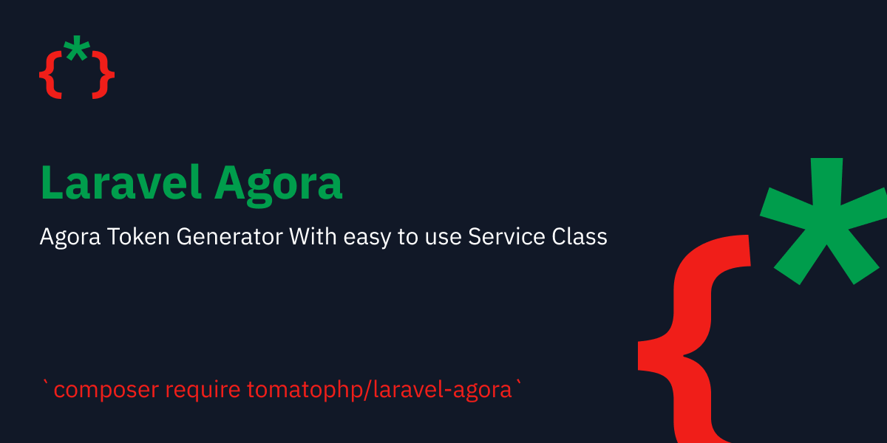

# Laravel Agora

Agora Token Generator With easy to use Service Class

## Installation

```bash
composer require tomatophp/laravel-agora
```

publish config file

```bash
php artisan vendor:publish --tag="laravel-agora-config"
```

go to your env and add you can find it from [Project Management](https://console.agora.io/)

```.dotenv
AGORA_APP_ID=
AGORA_APP_CERTIFICATE=
```

## Using

you can use the class to return your token like

```php
Agora::make(id: 1)->uId(rand(999, 1999))->token();
```

it will generate Audio/Video Token as a Publisher

the channel name will be `agora.USER_ID`

### Join To Channel

if you went to join an exists channel use this where id is the user you went to connect with

```php
Agora::make(id: 1)->uId(rand(999, 1999))->join()->token();
```

### Create Audio Only

if you went an audio channel only use this

```php
Agora::make(id: 1)->uId(rand(999, 1999))->join()->audioOnly()->token();
```

### Custom Channel

you can custom your channel name by use 

```php
Agora::make(id: 1)->uId(rand(999, 1999))->channel('custom')->token()
```

than your channel will be `custom.USER_ID`

## Support

you can join our discord server to get support [TomatoPHP](https://discord.gg/Xqmt35Uh)

## Docs

you can check docs of this package on [Docs](https://docs.tomatophp.com/plugins/laravel-console-helpers)

## Changelog

Please see [CHANGELOG](CHANGELOG.md) for more information on what has changed recently.

## Security

Please see [SECURITY](SECURITY.md) for more information about security.

## Credits

- [Fady Mondy](mailto:info@3x1.io)

## License

The MIT License (MIT). Please see [License File](LICENSE.md) for more information.
